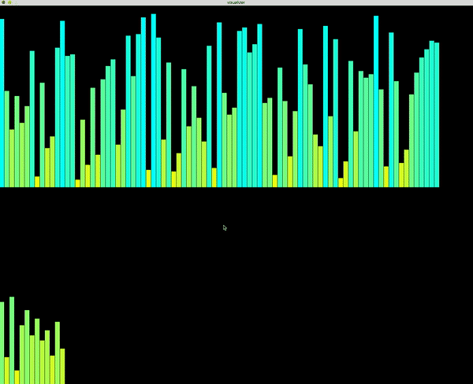

# push_swap

DESCRIPTION : You are given a list of numbers (stack) and you have to sort it with a set number of instructions which are printed
by the push_swap program, the checker program makes sure that your stack is well sorted after the sorting algorithm

USAGE :

- CHECKER : ARG=`numbers`; ./checker $ARG
- PUSH_SWAP : ARG=`numbers`; ./push_swap $ARG
- PUSH_SWAP + CHECKER : ARG=`numbers`; ./push_swap $ARG | ./checker $ARG (note that push_swap has always to give
the list of instructions which is piped into the checker program)
- PUSH_SWAP + VISUALIZER : ARG=`numbers`; ./push_swap $ARG | ./visual $ARG

You can use the following script at the place of 'numbers' to generate a defined range set of numbers :
          ruby -e "puts (-550..549).to_a.shuffle.join(' ')"
-EXAMPLE : ARG=`ruby -e "puts (-550..549).to_a.shuffle.join(' ')"`; ./push_swap $ARG | ./checker $ARG

